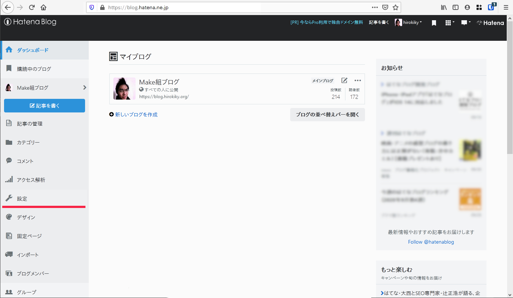
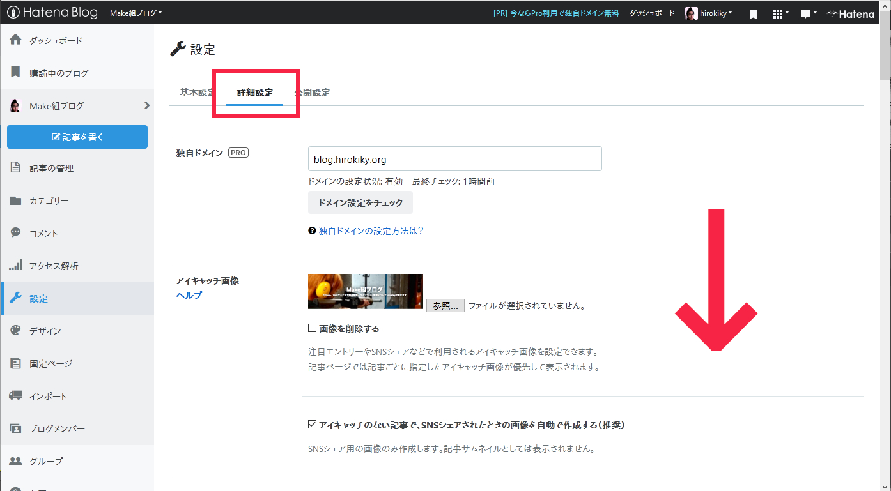
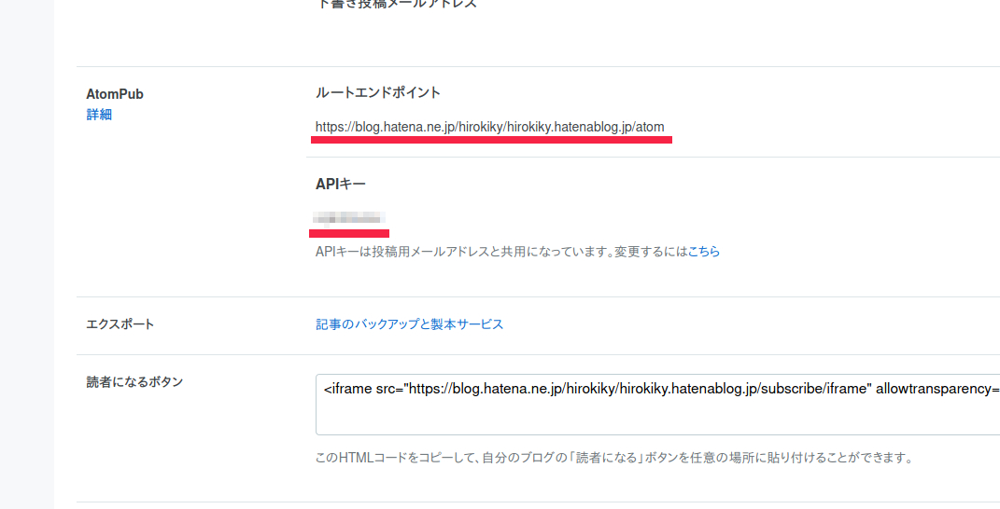

# 外部サイトへの配信・連携を設定する

**現在Shodoは、はてなブログへの連携にのみ対応しております** 。
その他のサイトへの連携は今後対応される予定です。

## はてなブログとの連携を設定する

Shodoで執筆・レビューした記事をはてなブログに投稿できます。
Shodoではプロジェクトごとに、はてなブログで作成されたブログを登録し、執筆タスクごとに記事を作成できます。

### はてな連携の注意点

**以下、連携の設定は、はてなブログのオーナーのみ可能です**。

また、AtomPub APIを通したブログへの投稿はブログのオーナーのみ可能です。
ShodoではShodo内のメンバーが後述するAPIキーをプロジェクト内で共有することで記事の投稿を行います（APIキーはShodoのメンバー内では公開されません）。
これは、はてなブログAtomPubの仕様によるものです。

（OAuthを利用した認証では、はてなのブログメンバーがAtomPub API経由で記事の投稿が行えないため、この連携方法を採用しております）。

### はてなブログからAtomPubのURLを取得する

はてなブログのダッシュボードを開いてください。

* はてなのダッシュボードを開く：[https://blog.hatena.ne.jp/](https://blog.hatena.ne.jp/)

画面左の「設定」を開いて、「詳細設定」にアクセスしてください。

画面下部にスクロールして、AtomPubの設定を見つけます。
AtomPubから「ルートエンドポイント」に書かれたURLと、「APIキー」をメモしておいてください。

たとえば `https://blog.hatena.ne.jp/hirokiky/hirokiky.hatenablog.jp/atom` のようなURLがエンドポイントのURLになります。

### Shodoの設定画面にペーストする

Shodoの執筆アプリからプロジェクトを選び、サイドバーから「設定」、「配信」をクリックしてください。

ブログの名前と、コピーした「ルートエンドポイント」のURLと「APIキー」を入力してください。
「ブログ名」には任意の名前を入力できます（Shodo内でのみ表示される値です）。

入力できればボタンをクリックすれば設定は完了です。

APIキーの値はShodo内の他メンバーには表示されません。

### Shodoから記事を配信する

Shodoの執筆タスクから「配信」をクリックして執筆した記事の配信ができます。
はてなブログには下書きで記事が作成されるので、公開されてしまう心配はありません。

記事の配信はライター以上のアカウントで可能です。
